# Manual de Usuario - JavaLang Interpreter

## Índice
- [Manual de Usuario - JavaLang Interpreter](#manual-de-usuario---javalang-interpreter)
  - [Índice](#índice)
  - [Objetivos](#objetivos)
    - [General](#general)
    - [Específicos](#específicos)
  - [Introducción](#introducción)
  - [Requisitos del Sistema](#requisitos-del-sistema)
  - [Flujo de Funcionalidades del Programa](#flujo-de-funcionalidades-del-programa)
    - [Nuevo](#nuevo)
    - [Abrir](#abrir)
    - [Guardar](#guardar)
    - [Tabla de Errores](#tabla-de-errores)
    - [Tabla de Símbolos](#tabla-de-símbolos)
    - [Generar AST](#generar-ast)
    - [Ejecutar](#ejecutar)
  - [Funcionalidades Añadidas para esta fase](#funcionalidades-añadidas-para-esta-fase)
    - [Flujo de las nuevas funcionalidades](#flujo-de-las-nuevas-funcionalidades)
      - [Ejecutar código aarch64 desde la interfaz de usuario](#ejecutar-código-aarch64-desde-la-interfaz-de-usuario)
      - [Ejecutar código aarch64 desde la consola](#ejecutar-código-aarch64-desde-la-consola)

## Objetivos

### General
El objetivo general de este manual es explicar el flujo de funcionamiento del intérprete de JavaLang, desde la edición del código hasta su ejecución y la visualización de reportes.

### Específicos
1. **Comprensión del sistema**: Proporcionar una comprensión clara de la interacción entre los distintos componentes del intérprete, como el análisis léxico, sintáctico, semántico y la ejecución del código.
2. **Facilidad de uso**: Facilitar el uso de la herramienta mediante una guía detallada y paso a paso.
3. **Detalle de funcionalidades**: Detallar las funcionalidades del software, incluyendo la edición de código, ejecución y visualización de los resultados.

## Introducción
Este manual tiene como objetivo proporcionar los conocimientos necesarios para utilizar el intérprete de JavaLang de manera efectiva. Aquí se describen detalladamente las funcionalidades del software, con especial énfasis en su flujo de trabajo.

El programa es un intérprete funcional para un lenguaje académico llamado JavaLang, cuya sintaxis se inspira en Java. El objetivo principal es que los estudiantes puedan comprender e implementar los principales componentes de un compilador. El software incluye una interfaz gráfica que facilita la escritura, análisis y ejecución del código fuente.

El sistema permite al usuario crear, abrir, editar y guardar archivos con la extensión `.usl`. Una vez ejecutado, el intérprete es capaz de analizar, validar e interpretar el código. La salida del programa se muestra en un panel de consola, y además se generan reportes detallados del Árbol de Sintaxis Abstracta (AST), la tabla de símbolos y los errores detectados.

## Requisitos del Sistema
Antes de comenzar a utilizar el intérprete de JavaLang, asegúrese de que su sistema cumple con los siguientes requisitos:
- **Sistema Operativo**: Compatible con los compiladores de C y bibliotecas de desarrollo requeridas.
- **Compilador**: Un compilador de C, como GCC, para compilación y ejecución del código.
- **Herramientas de Generación**: Flex para el análisis léxico y Bison para el análisis sintáctico.
- **Herramientas de Compilación**: Makefile para gestionar la compilación del proyecto.
- **Biblioteca para la GUI**: Gtk3 para la interfaz gráfica del usuario.
- **Hardware Mínimo**: Se recomienda un procesador y memoria RAM suficientes para ejecutar un entorno de desarrollo y las herramientas mencionadas.

## Flujo de Funcionalidades del Programa

Al iniciar el programa, se encuentra con la siguiente pantalla principal que contiene los siguientes elementos:

1. Nuevo
2. Abrir
3. Guardar
4. Guardar Como
5. Tabla de Errores
6. Tabla de Símbolos
7. Generar AST
8. Ejecutar
9. Campo de Entrada
10. Campo de Salida

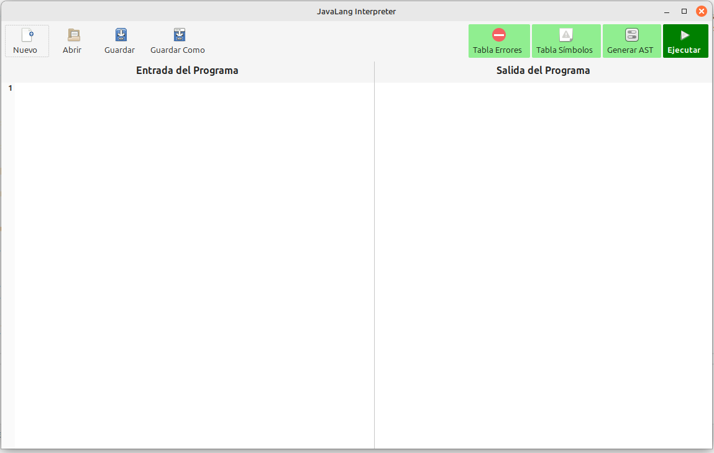

### Nuevo

Al seleccionar la opción de **Nuevo**, se limpia todo el campo de Entrada para poder iniciar con un nuevo documento. Sin embargo, el contenido en el Campo de Salida se mantiene tal como estaba previamente.

### Abrir

Al presionar la opción de **Abrir**, se abre el explorador de archivos. Dentro del explorador de archivos, únicamente se pueden abrir documentos con la extensión `.usl`, que serán los únicos que se mostrarán.

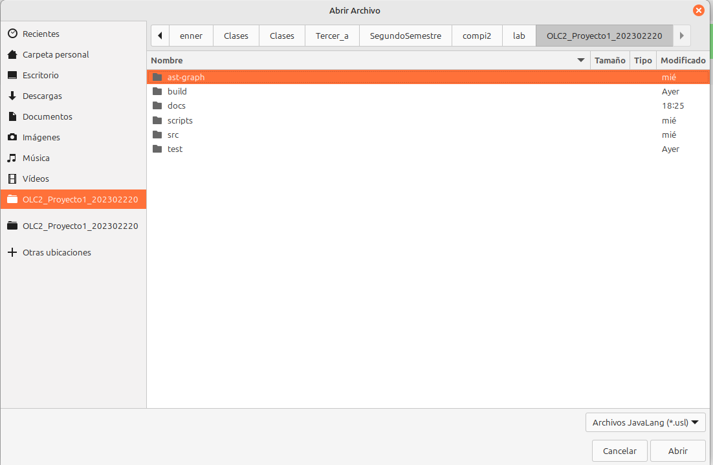

Una vez que se selecciona un archivo, se cargará todo su contenido dentro del Campo de Entrada. Dentro del campo de Entrada se puede observar que se reconoce correctamente el lenguaje basado en Java que se está usando y se aplica el resaltado de sintaxis correspondiente.

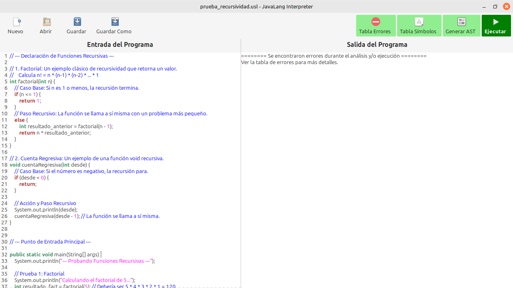

### Guardar

Al seleccionar la opción de **Guardar**, se guardará el archivo en la dirección de donde se obtuvo el archivo que se abrió. Si se está creando un archivo nuevo, se abrirá el explorador de archivos para guardar el archivo en la dirección y con el nombre que se desee.

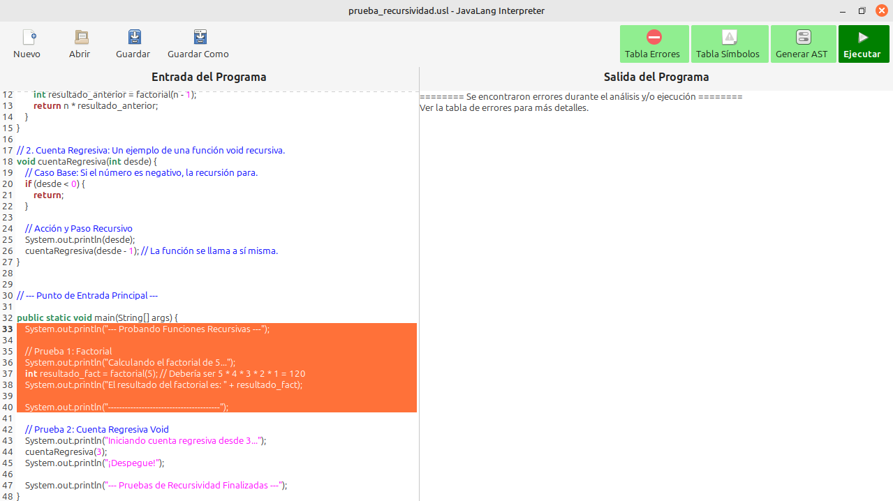

Para probar la opción de Guardar, abrimos el archivo que se muestra en la imagen a continuación:

Al seleccionar la opción de **Guardar Como**, se abrirá el explorador de archivos para guardar el archivo en la dirección y con el nombre que se desee. Sin importar cuántas veces se haya guardado, siempre al presionar esta opción, se realizará esta acción.

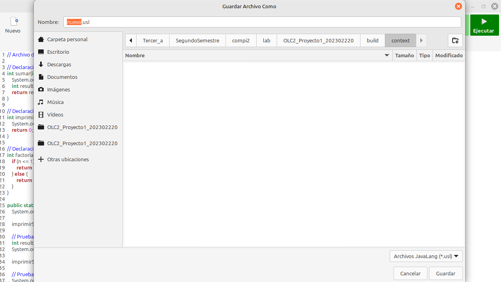

### Tabla de Errores

Al presionar la opción de **Tabla de Errores**, se mostrará una tabla con errores. Si no hay errores en el código, la tabla se mostrará vacía.

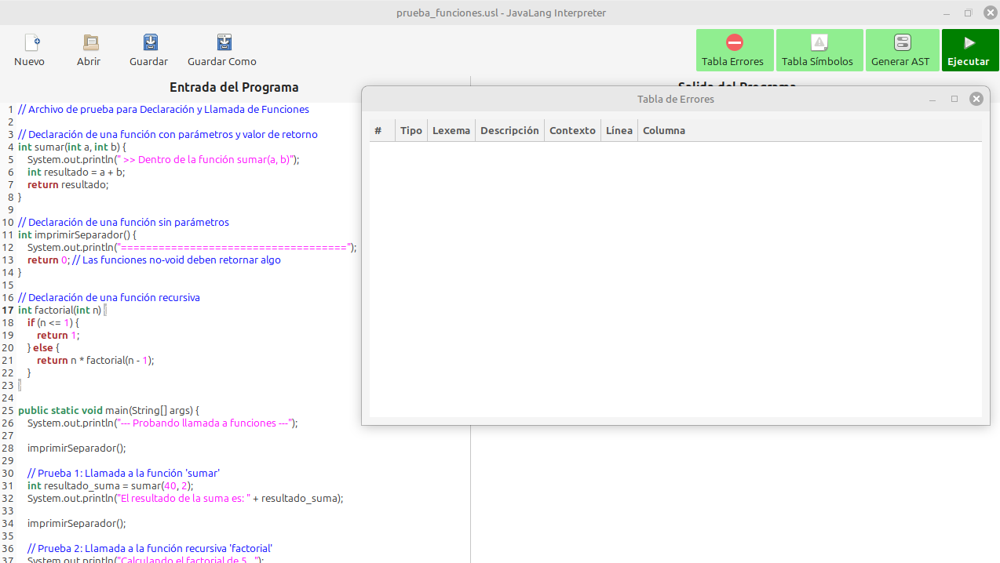

Para mostrar el funcionamiento, se introducen dos errores léxicos y uno sintáctico en el código.

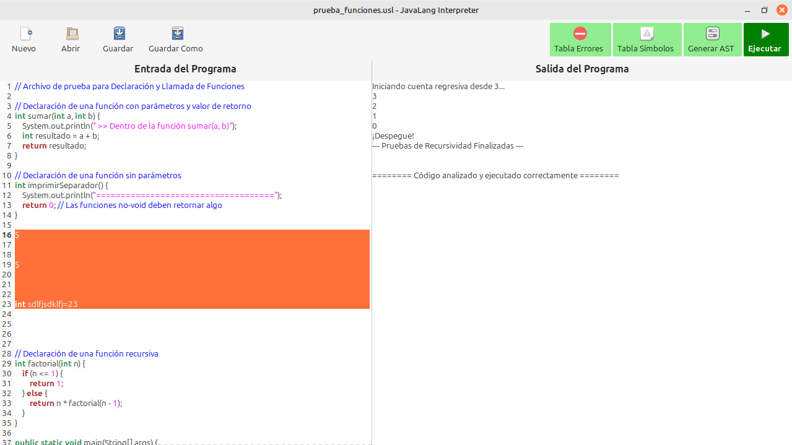

Como se puede observar, se mostrarán correctamente los errores en esta tabla.

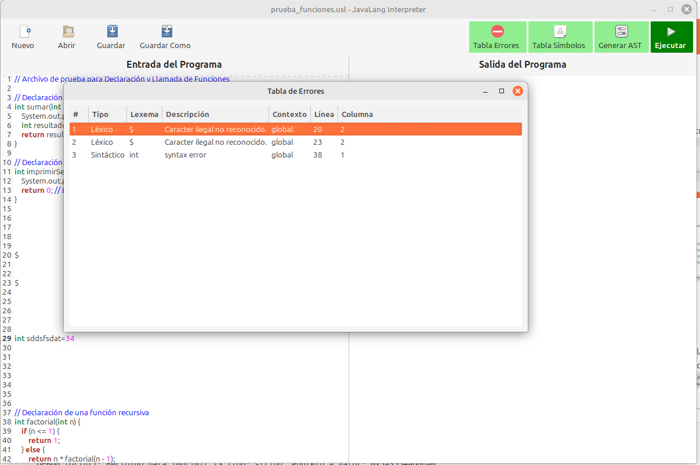

### Tabla de Símbolos

Si se presiona la opción de **Tabla de Símbolos**, se mostrará una tabla con todos los símbolos declarados, siempre y cuando no haya errores en el código. Esto es útil para verificar las variables y funciones definidas en su programa.

### Generar AST

Al seleccionar la opción de **Generar AST**, se mostrará el Árbol Sintáctico Abstracto (AST) del código que se colocó dentro de la entrada del programa.

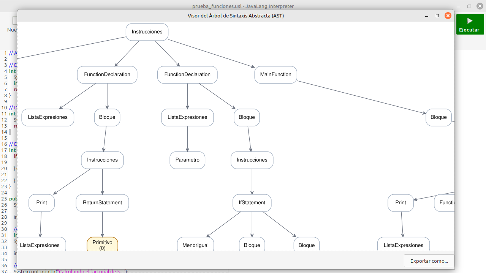

Además, esta opción presenta la posibilidad de **Exportar como**, que muestra el explorador de archivos para guardar el AST en formato SVG o PDF, dependiendo de su preferencia.

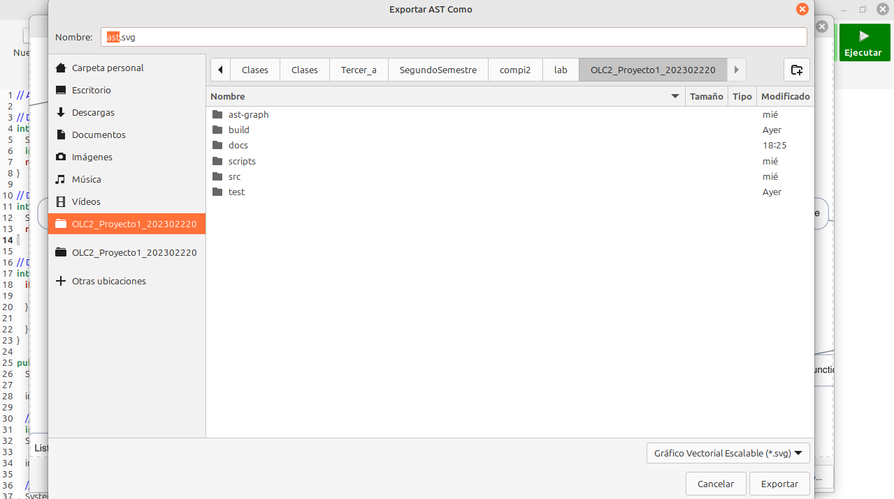

### Ejecutar

Finalmente, está la opción de **Ejecutar**, que ejecuta el código de entrada y muestra su salida en el Campo de Salida. Esto es útil para probar y depurar su código.

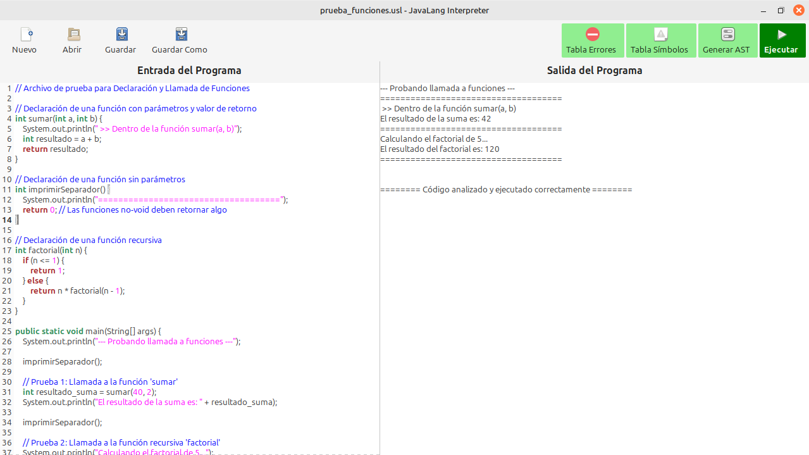

## Funcionalidades Añadidas para esta fase

En esta fase, debio a los requrimientos, se le añadieron funcionalidades al programa, las cuales son:

1. Compilar
2. Ensamblar y Ejecutar

Todas las demas funcionalidades del programa no se vieron afectada. Ahora bien, ¿Qué hacen estos nuevos botones adicionados?

### Flujo de las nuevas funcionalidades

A la hora de colocar código dentro del **campo de entrada** se puede dar click a **ejecutar**, eso ya se sabe, pero, si en vez de eso, se hace click en el botón de **compilar**, se creará un archivo llamado ``salida.s``, el cual contendrá el código de la entrada en ``aarch64`` listo para ser ejecutado y realizar lo que el programa de entrada realizaría. Esto se llama **compilación**.

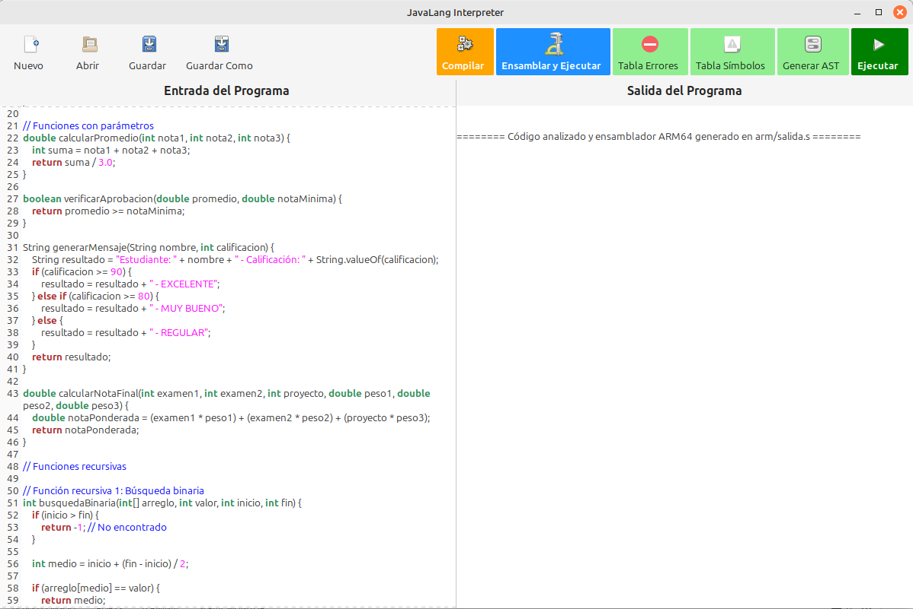

Se puede observar el archivo creado en la carpeta ``aarch64`` dentro de la carpeta raiz del programa:

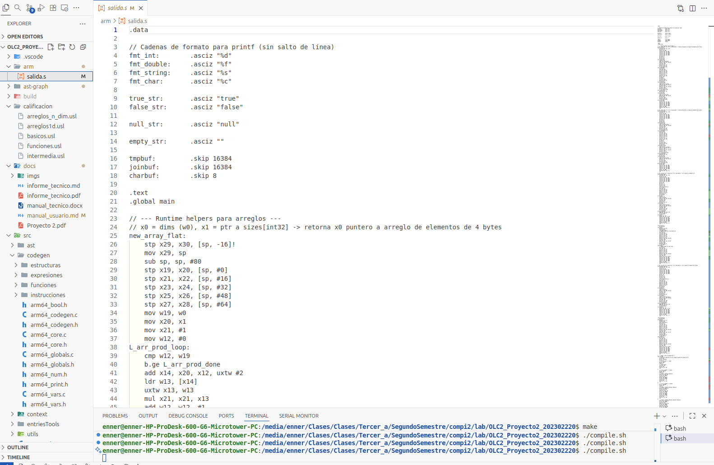

Previo a la compilación siempre se continua realizando el proceso de análisis léxico, sintáctico y semántico heredado de la funcionalidad de **Ejecutar**.

Ahora este programa se puede ejecutar de nos maneras:

#### Ejecutar código aarch64 desde la interfaz de usuario

La opción más simple para ejecutar el código ``aarch64`` generado después de la **compilación** es mediante el botón **Ensamblar y Ejecutar**, este botón realiza las acciones de **ensamblado**, **enlazado** y **ejecuta el código** dentro del **campo de salida**, para que de esta forma se pueda observar el funcionamiento sin salir de la interfaz de usuario.

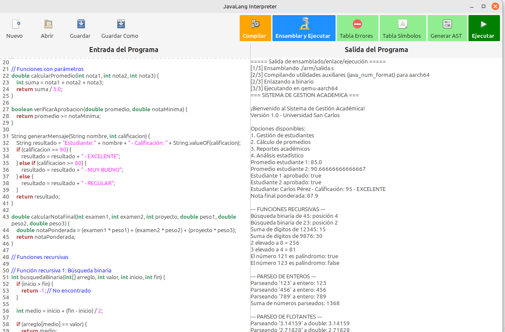

#### Ejecutar código aarch64 desde la consola

Otra opción para ejecutar este código es mediante la **consola**. Dentro de la raiz del proyecto se encuentra un script llamado ``ensamblar.sh``, que al ejecutarse, **ensambla**, **enlace** y **ejecuta el código** en ``aarch64`` en la cosola.

